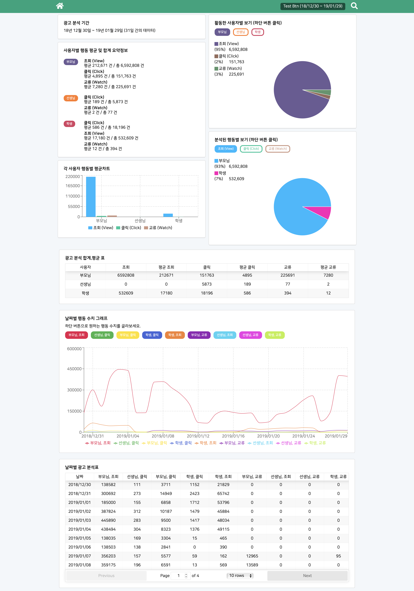
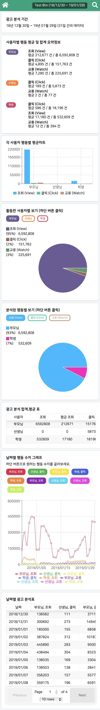

# Ad Performance Report

웹 | 모바일
------------ | -------------
 | 


---

### 실행 방법
yarn install \
yarn build \
yarn start

---

### 기술스팩
- ES6
- Next.js
- React.js
- Redux
- Redux-saga
- styled-components
- recharts
---

### CSV data

> 데이터 파일 기간 : 2018/12/30 ~ 2019/01/29\
기간이 1월 이라고 가정하에 페이지 시작.

---

API는 express로 웹 서버를 띄우고, Next.js 에서 커스텀한 express 서버로 바꿔서 띄웁니다.

data는 'static/csv/*.csv' 파일에서 가져오며,

데이터 GET API는 단 한개로 '/api/data'
query string

- data : Json string Array

빈 어레이 일시, 모든 csv 파일 정보 GET

```
API : /api/data
Type : GET
Query string
data : json string (array)

response
{
    data : Object
    noData : Boolean,
    searchRange : Array,
    status : Number (200,404),
    totalData : Object
}
```

> data : 날짜 Key, 해당 Key 날짜 데이터 Array \
noData : 검색 날짜 내 데이터 유무 \
searchRange : 검색 날짜 Array \
totalData : 검색 날짜 데이터 이벤트 별 총합

---

### Custom Next.js config

/pages/_document.js : Next.js + styled-components \
/pages/_app.js : Next.js + Redux(+redux-saga)